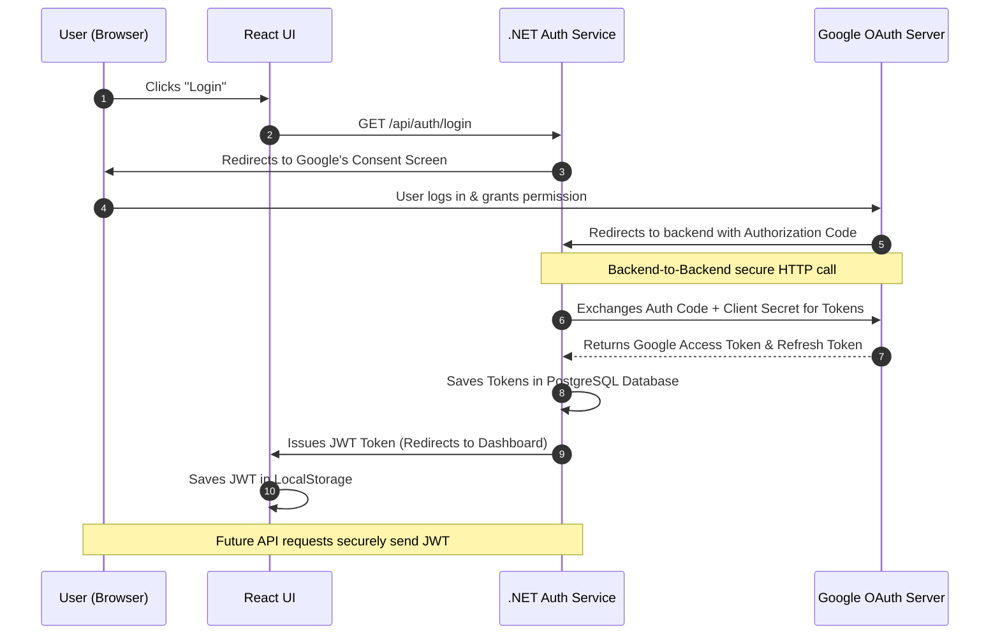

# Understanding OAuth 2.0 & Our Authentication Flow

When integrating with external APIs like Google's, you will inevitably hear about "OAuth 2.0". It can be confusing at first, but understanding the core flow is crucial for modern web development.

## What is OAuth 2.0?
OAuth (Open Authorization) 2.0 is an industry-standard protocol for **authorization**. It allows a user to grant a third-party application (our web app) access to their resources (their YouTube data) housed on an external server (Google) *without giving the app their password*.

## The Actors in our App
1. **Resource Owner:** The User.
2. **Client:** Our application (.NET Backend + React Frontend).
3. **Authorization Server:** Google's login servers.
4. **Resource Server:** Google's YouTube API servers.

## The Flow: "Authorization Code Flow"
We are using the most secure flow, strictly designed for applications with a backend server. Here is how it works visually:

Here is how it works step-by-step in our app:

1. **The Request:** The user clicks "Login" on the React frontend. The frontend redirects them to the .NET backend (`/api/auth/login`).
2. **The Redirect:** The .NET backend redirects the user to Google's specific login page, passing along our `Client ID` and asking for the `youtube.readonly` **scope**.
3. **User Consent:** The user logs in to Google and sees the Consent Screen asking if our app is allowed to view their YouTube data. The user clicks "Allow".
4. **The Code:** Google redirects the user *back* to our .NET backend (specifically to the `redirect_URI` we register, e.g., `/signin-google` or `/api/auth/callback`) and attaches a temporary, one-time-use string called an **Authorization Code** to the URL.
5. **The Exchange (Backend Only):** Our backend takes this Authorization Code, bundles it with our highly guarded `Client Secret`, and sends a background HTTP request back to Google.
6. **The Tokens:** Google verifies the code and our secret. Upon success, Google replies to our backend with two important strings:
   - An **Access Token**: The key to open the door to the YouTube API. It usually expires after 1 hour.
   - A **Refresh Token**: A long-lasting key whose only purpose is to ask Google for *new* Access Tokens without requiring the user to log in again.
7. **The Internal Session:** Our backend saves these tokens in the PostgreSQL database. It then creates its own secure "session cookie" and hands it to the React frontend browser. 
8. **Subsequent API Calls:** Whenever React wants the "Liked Videos", it issues a request to our backend containing the session cookie. Our backend looks up the user, grabs their active `Access Token` from the database, and queries the YouTube API securely on the user's behalf.

## Why use a Backend for this?
If we solely used React, the application would run purely in the user's browser. To exchange the Authorization Code for Tokens (Step 5), the application *must* provide its `Client Secret`. If we did this in React, the `Client Secret` would be sent to the user's browser, meaning anyone inspecting the code could steal it and impersonate our application.

By routing the flow through .NET 8, the secret stays entirely on our server, ensuring enterprise-grade security.
