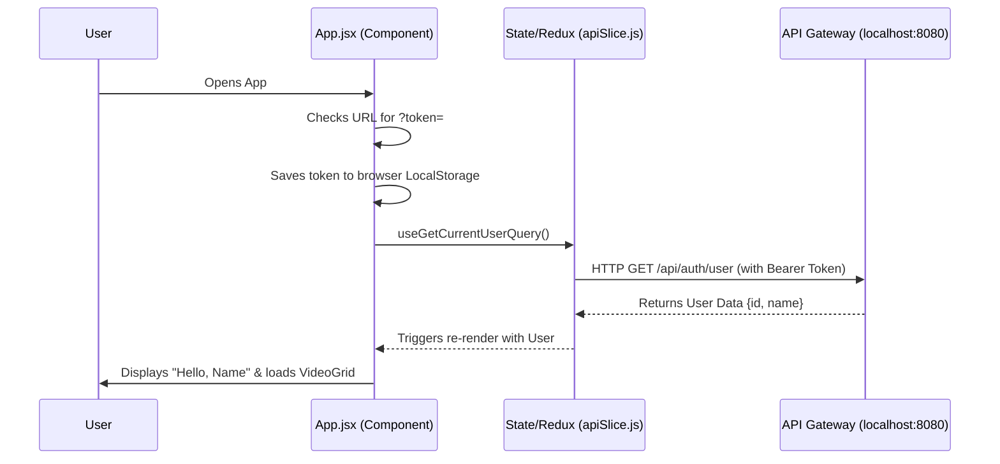

# React JS Fundamentals: YouTube Vault Learning Guide

Welcome to React! This document uses the `YouTubeSearch` frontend codebase as a practical, real-world example to explain the core concepts of React, state management, and modern frontend best practices. 

Whether you have zero background in React or just need a refresher, this guide will walk you through everything happening under the hood.

---

## 1. High-Level Architecture & Data Flow

Before looking at the code, let's understand how data moves in your application. 

---

## 2. Core Concepts in Action

### Concept 1: The Entry Point (`main.jsx`)
Every React app has a starting point where the React framework attaches itself to the standard HTML file (`index.html`). 

**What happens here:**
1. React finds the `
` in your HTML.
2. It renders the `<App />` component inside that div.
3. It wraps the app in a `<Provider>`. This is how **Redux** (our state manager) shares data with the entire app without passing it down manually file-by-file.

> **💡 Best Practice: StrictMode**
> You'll notice `<React.StrictMode>`. This is a development-only tool that runs your code *twice* to catch hidden bugs and ensure you aren't using outdated React features. Always leave this on.

---

### Concept 2: State Management & Data Fetching (`store.js` & `apiSlice.js`)

In React, when data changes (state), the UI automatically updates (re-renders). For simple things, we use built-in React tools. For complex global data (like server API calls), we use a library called **Redux Toolkit (RTK)**.

**`apiSlice.js`** is the brain of your network requests.
- **`baseUrl`**: It tells React that all API calls should go to `http://localhost:8080/api/`.
- **`prepareHeaders`**: This is a brilliant **Security Best Practice**. It intercepts *every* outgoing network request, reads your saved JWT token from `localStorage`, and automatically attaches it as an `Authorization: Bearer` header. 
- **Auto-generated Hooks**: It defines endpoints like `getLikedVideos`. RTK automatically generates a custom React "Hook" called `useGetLikedVideosQuery` that we can use anywhere in our code.

---

### Concept 3: The Main Shell (`App.jsx`)

`App.jsx` is the primary layout. It introduces two of the most important concepts in React: **Hooks** and **JSX**.

#### What are Hooks?
Hooks are functions that let you "hook into" React features like memory and lifecycles. 
- `useState`: Creates a piece of memory. `const [tokenResolved, setTokenResolved] = useState(false);` creates a variable `tokenResolved` and a function to update it.
- `useEffect`: Runs side-effects. In our code, it runs exactly *once* when the page loads (because of the `[]` array at the end) to check if there is a `?token=` in the URL from the Google Login.

#### What is JSX?
JSX looks like HTML, but it's actually JavaScript! Look at the `return()` statement in `App.jsx`.
- It lets us write `className` instead of `class` (because `class` is a reserved word in JS).
- It lets us inject variables directly into the HTML using curly braces: `{user.name}`.
- It lets us do **Conditional Rendering**: `{!user ? <LoginButton /> : <VideoGrid />}`. This tells React: "If the user is NOT logged in, show a login button. Otherwise, show the Video Grid."

---

### Concept 4: Displaying Lists (`VideoGrid.jsx`)

This file is a perfect example of a reusable UI component.

1. **Loading & Error States:** It calls `const { data: videos, isLoading, error } = useGetLikedVideosQuery();`. 
   > **💡 Best Practice:** Always handle `isLoading` and `error` states before trying to render data. This prevents the app from crashing.
2. **Mapping over Arrays:** To render a list in React, you don't use a `for` loop. Instead, you use the standard JavaScript `.map()` function. 
3. **The `key` Prop:** Notice `key={video.id}`? When mapping lists, React demands a unique `key` for every item. This is a massive **Performance Best Practice**. It allows React to know exactly which video was added or removed without re-drawing the entire grid.

---

## 3. Scaling to a Complex Project (Alternatives)

While the current stack (Vite + React + Redux Toolkit + Tailwind) is superb and highly performant, here are alternatives you would consider if this project grew into a massive enterprise application like YouTube itself:

### A. Routing
Currently, we only have one page (`App.jsx`). 
- **Alternative:** If you add multiple pages (e.g., `/settings`, `/search`, `/profile`), you should install `react-router-dom` to handle navigation without refreshing the browser.

### B. Frameworks (Next.js vs Vite)
Vite builds a "Single Page Application" (SPA). The server sends a blank HTML page, and React builds the UI in the browser.
- **Alternative:** For a highly public site that needs **Search Engine Optimization (SEO)**, you would use **Next.js**. Next.js renders the React code on the backend server (Server-Side Rendering) so Google's search bots can read the HTML instantly.

### C. Folder Structure (Feature Slices)
Currently, folders are split by type (`/components`, `/store`). 
- **Alternative:** In a massive app, you use **Feature-Driven Architecture**. You would group files by feature:
  - `/features/videos/VideoGrid.jsx`
  - `/features/videos/videoApi.js`
  - `/features/auth/Login.jsx`

### D. Data Fetching (React Query vs RTK Query)
You are using **RTK Query** right now, which is phenomenal. 
- **Alternative:** **TanStack React Query** is the industry standard alternative. It does the exact same thing (caching, loading states) but doesn't require setting up a Redux Store. If you don't need complex global state (like a shopping cart), React Query is often simpler to set up than RTK Query.
