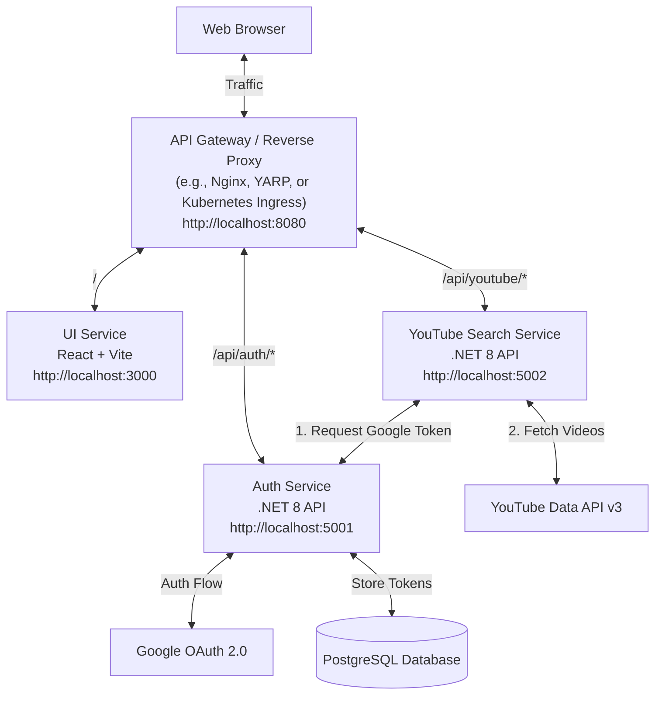

# High-Level and Low-Level Design (HLD & LLD)

## High-Level Design (HLD)

The application follows a **microservices architecture**, decoupling the user interface, authentication, and core domain logic. An API Gateway / Reverse Proxy sits in front to handle routing from the browser.

### Architecture Diagram

### Component Responsibilities
1. **API Gateway (Nginx / YARP / Kubernetes Ingress)**: Acts as the single entry point for the browser. It routes `/api/auth` traffic to the Auth Service, `/api/youtube` traffic to the YouTube Service, and all other traffic (like static assets and React routes) to the UI Service.
2. **UI Service (React)**: Handles frontend rendering and user interaction. It knows nothing about the backend port numbers directly, communicating only through the Gateway.
3. **Auth Service (.NET 8)**: Dedicated entirely to managing the Google OAuth 2.0 flow, validating sessions, issuing secure HTTP-only session cookies, and exclusively owning the Database to store user data and OAuth tokens.
4. **YouTube Search Service (.NET 8)**: Dedicated to interacting with the YouTube API. It has NO direct database access. To get the required Google Access Token, it makes a secure internal REST API call to the Auth Service.
5. **Database (PostgreSQL)**: Owned exclusively by the Auth Service.

---

## Low-Level Design (LLD)

### 1. Database Schema
Owned and managed exclusively by the `AuthService`.
**Table: `Users`**
- `Id` (Guid, Primary Key)
- `GoogleId` (String, Unique)
- `Email` (String)
- `Name` (String)
- `GoogleAccessToken` (String) - *For API calls*
- `GoogleRefreshToken` (String) - *To acquire new access tokens*
- `TokenExpiration` (DateTimeUtc)

### 2. Backend Services

**Auth Service (e.g., Port 5001)**
- `GET /api/auth/login`: Redirects user to Google OAuth.
- `GET /api/auth/callback`: Exchanges code for tokens, writes to DB, issues session cookie.
- `POST /api/auth/logout`: Clears cookie.
- `GET /api/auth/user`: Returns basic user info to the UI.
- `GET /api/internal/users/{id}/google-token`: **Internal endpoint** (secured via internal API keys or network isolation) used by the YouTube Service to retrieve a user's active Google Access token.

**YouTube Search Service (e.g., Port 5002)**
- `GET /api/youtube/liked-videos`: Requires the unified session cookie. It extracts the User identity, makes an internal REST call to the Auth Service to retrieve the user's `GoogleAccessToken`, calls the YouTube Data API, and returns formatted video metadata.

### 3. Frontend Architecture (React)

**Routing**
- `/`: Public landing page (Shows "Login with Google" button).
- `/dashboard`: Protected route. Displays the grid of liked videos.

**State Management & Data Fetching (Scalable Approach)**
Since the goal is to ramp up on enterprise-ready React architectures, we will step away from purely local `useState` flows and adopt robust state management infrastructure:
- **Client State Management**: **Redux Toolkit (RTK)**. While our MVP client state is small, establishing an RTK store provides a clear, scalable architectural pattern for future features (e.g., complex filtering, offline modes). 
- **Server State Management (Data Fetching)**: **RTK Query** (built directly into Redux Toolkit). We will use RTK Query for fetching data from the `.NET APIs`. This automatically handles caching, loading states (`isLoading`), and deduplication of requests cleanly.

**Core Components**
- `App.jsx`: Root component, provides RTK Redux Provider.
- `LoginButton.jsx`: Redirects via the gateway to `/api/auth/login`.
- `VideoGrid.jsx`: Uses an RTK Query hook like `useGetLikedVideosQuery()` to fetch and display data reactively.
- `VideoCard.jsx`: Reusable UI component displaying video meta.
